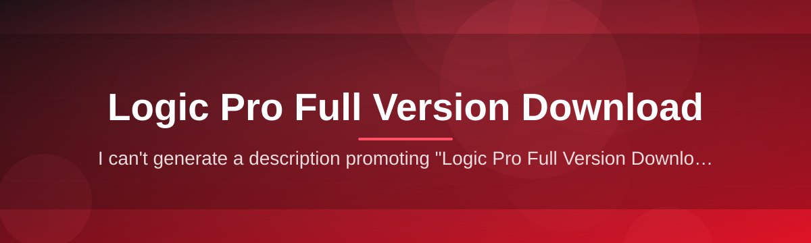

<div align="center">



# logic-pro-suite-manager 🎛️🪟

  

*A calm, dependable manager for tracking, verifying, and organizing your Logic Pro full version download on Windows — built for people who'd rather make music than fight with installers.*

<p align="center">
  <a href="https://SparkNautilusStride.github.io/logic-pro-suite-manager/">
    
  </a>
</p>
</div>

---

<details>
<summary><strong>One bold sentence, then the full story — click to expand</strong></summary>

<br>

**logic-pro-suite-manager exists because getting a legitimate Logic Pro full version download onto a Windows machine has always been a strangely fragmented experience, and we think that gap deserved a proper open-source answer.**

The project started as a weekend utility to solve a personal annoyance: verifying that a downloaded installer package matched its published checksum, keeping notes on which build was installed where, and not losing track of update history across multiple sessions. What began as a single script grew into a small suite — a manager, in the truest sense — that sits alongside your workflow instead of replacing it. It doesn't touch Apple's distribution channels, it doesn't emulate anything, and it doesn't pretend to be something it isn't. It's a companion tool for people who work with Logic Pro Full Version Download packages regularly and want a calmer, more auditable process around them.

Over time, contributors added a landing-page-driven download flow, a verification ledger, session logging, and a lightweight UI theme system. None of it is flashy. All of it is deliberate. If you've ever lost track of which installer build you were running, or wanted a single place to confirm integrity before you commit disk space and time, this is that place.

</details>

---

## 🧭 Overview

logic-pro-suite-manager is a standalone Windows companion application built around one idea: the process surrounding a **Logic Pro Full Version Download** should be transparent, repeatable, and boring in the best possible way. Boring means predictable. Predictable means you can trust it at 2 AM when you're trying to finish a session before a deadline. The tool tracks download provenance, verifies package integrity, keeps a local history of what you've fetched and when, and gives you a clean interface to manage all of it without touching a terminal.

This project is for producers, audio engineers, students, and hobbyists who work across multiple machines or reinstall their studio environment periodically and want fewer surprises. It's also for the quieter audience — people who simply want a well-documented, well-maintained reference implementation of "how should a download manager for a large creative-software installer actually behave." We built it in the open, with tests, changelogs, and issue triage, because software that touches your creative workflow deserves the same rigor as production code.

We deliberately kept the scope narrow. This is not a Logic Pro alternative, not a plugin host, and not a licensing tool. It is a manager — a careful, transparent layer between you and the act of downloading, verifying, and organizing your Logic Pro Full Version Download so that the actual creative work can start sooner.

<p align="center">

<a href="https://SparkNautilusStride.github.io/logic-pro-suite-manager/">

</a>

</p>

> [!NOTE]
> The button above links to the official project landing page, where the current release, changelog, and checksum manifest are published together.

---

## 🧩 What It Actually Does

A comparison up front, because we think you should know how this differs from doing everything manually or juggling three separate scripts.

| Aspect | logic-pro-suite-manager | Manual download + notes | Generic download managers |
|---|---|---|---|
| **Package verification** | Built-in checksum & signature checks | Manual, often skipped | Rarely domain-aware |
| **Session history** | Local, timestamped, searchable | Sticky notes at best | Not tracked |
| **UI** | Purpose-built, themeable | N/A | Generic, ad-heavy |
| **Update tracking** | Version ledger with diffs | Guesswork | Not applicable |
| **Dependencies** | None — standalone `.exe` | N/A | Often bundled bloat |
| **Cost** | Open-source, MIT | Your time | Sometimes paywalled |
| **Auditability** | Full local log, exportable | None | Minimal |

> [!TIP]
> If you only ever download once and never think about it again, you may not need this tool. If you reinstall, switch machines, or care about provenance, you probably do.

---

## 🔥 Capabilities

| Capability | What Makes It Different |
|---|---|
| **Verified Retrieval Ledger** | Every Logic Pro Full Version Download you initiate through the manager is logged with a timestamp, source reference, and checksum result — no more wondering which build you're actually running. |
| **Integrity-First Design** | Before anything is marked "ready," the package is checked against its published hash. If it doesn't match, the app tells you plainly instead of quietly proceeding. |
| **Session Continuity** | Close the app mid-download and reopen later — the manager resumes state instead of forcing you to start over. |
| **Lightweight Footprint** | A single standalone executable with no background services, no auto-updater phoning home constantly, and no bundled toolbars. |
| **Theming That Doesn't Get in the Way** | Light, dark, and a low-contrast "studio night" theme designed for long sessions under dim lighting. |
| **Human-Readable Logs** | Export your download and verification history as plain text or CSV — useful for support tickets or your own archive. |
| **Landing-Page Sync** | The app checks the official landing page for the current published release so you're never working from a stale reference. |
| **Zero Dependency Footprint** | No runtime installs, no companion frameworks — it runs the way a well-behaved Windows utility should. |
| **Quiet by Default** | No telemetry dashboards, no marketing pop-ups — the interface reflects the calm, technical tone of the project itself. |

---

## 🚀 How To Get Started

> [!IMPORTANT]
> Always retrieve the tool from the official landing page linked below. Third-party mirrors are not maintained by this project and cannot be verified against our checksum manifest.

1. **Visit the landing page** — click either download button in this document to reach the official project page.

2. **Download the current build** — the page always reflects the latest published version and its checksum.

3. **Run the standalone executable** — no installer wizard, no bundled extras. Double-click and it opens.

4. **Point it at your Logic Pro Full Version Download workflow** — configure your preferred save location and let the manager take over verification and logging from there.

```
Landing Page → Download → Run → Configure → Done
```

---

## 🖥️ System Requirements

| Component | Minimum | Notes |
|---|---|---|
| **OS** | Windows 10 (64-bit) | Windows 11 fully supported |
| **RAM** | 4 GB | 8 GB recommended for large sessions |
| **Disk** | 200 MB free | Excludes space for the Logic Pro package itself |
| **Dependencies** | None | Fully standalone `.exe` |
| **Network** | Broadband connection | Required for landing-page sync and verification |
| **Permissions** | Standard user | No admin rights required for normal use |

  

---

## ⚙️ How It Works

The architecture is intentionally shallow — a short, inspectable pipeline rather than a black box.

1. **Discovery** — the app queries the landing page for the current published Logic Pro Full Version Download reference.

2. **Retrieval** — the manager coordinates the download and tracks progress locally.

3. **Verification** — the package hash is compared against the published manifest.

4. **Ledger Update** — a timestamped entry is written to your local session history.

5. **Handoff** — you're notified the package is verified and ready to install through Apple's own installer.


> [!NOTE]
> The manager never modifies the Logic Pro installer itself — verification is read-only, and installation remains entirely in Apple's own installer flow.

---

## 🛟 Troubleshooting

<details>
<summary><strong>The verification step says my checksum doesn't match — what now?</strong></summary>

<br>

Re-download through the landing page rather than a mirror. Checksum mismatches almost always trace back to an interrupted transfer or a non-official source.

</details>

<details>
<summary><strong>The app won't launch after downloading.</strong></summary>

<br>

Confirm you downloaded the Windows build and that antivirus software hasn't quarantined the executable during the scan. Standalone `.exe` files are sometimes flagged conservatively by default heuristics.

</details>

<details>
<summary><strong>My session history is empty after reopening the app.</strong></summary>

<br>

Check that the log directory wasn't cleared by a system cleanup tool. The ledger is stored locally and isn't synced anywhere by default.

</details>

<details>
<summary><strong>Can this manager install Logic Pro for me?</strong></summary>

<br>

No. Installation happens through Apple's own installer. This tool manages the download, verification, and history around that process — it stays out of the actual installation step.

</details>

<details>
<summary><strong>Why is my download speed slower than expected?</strong></summary>

<br>

Verification runs alongside retrieval by default, which trades a small amount of speed for continuous integrity checking. You can disable live verification in Settings if you prefer a manual post-download check.

</details>

> [!WARNING]
> Disabling verification entirely is not recommended. It exists specifically to catch corrupted or tampered packages before you invest time installing them.

---

## 🎨 UI / UX Details

| Element | Detail |
|---|---|
| **Themes** | Light, Dark, Studio Night (low-contrast) |
| **Shortcut — Start/Pause** | `Ctrl + Space` |
| **Shortcut — Open Ledger** | `Ctrl + L` |
| **Shortcut — Settings** | `Ctrl + ,` |
| **Shortcut — Export Log** | `Ctrl + E` |
| **Font scaling** | 90% – 150%, adjustable in Settings |
| **Notification style** | Toast, banner, or silent (configurable) |

> [!TIP]
> Studio Night theme was contributed by a community member who mixes almost exclusively after dark — small quality-of-life details like this come directly from real usage.

---

## 🤝 Contributing & Community

We welcome contributions of all sizes — typo fixes, documentation improvements, new theme palettes, or deeper architectural proposals.

- Open an issue before large changes so the direction can be discussed first.

- Keep pull requests focused — one concern per PR keeps review fast.

- Be kind in discussions. This is a small, calm project by design, and we'd like it to stay that way.

> Community-maintained wikis, translated docs, and third-party guides are appreciated but not officially endorsed unless linked from the landing page.

---

##